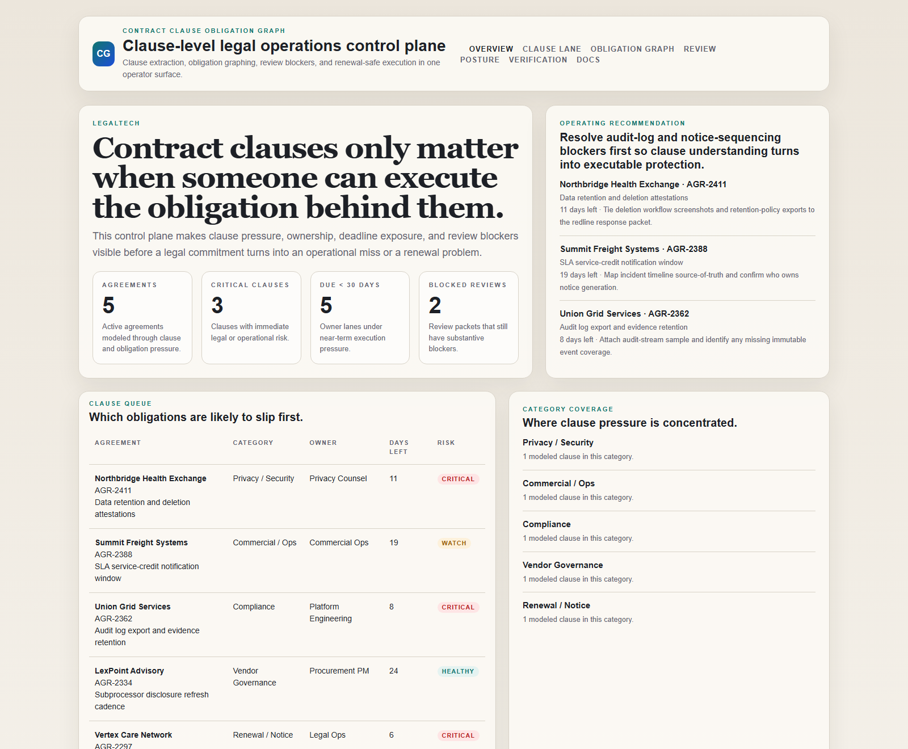
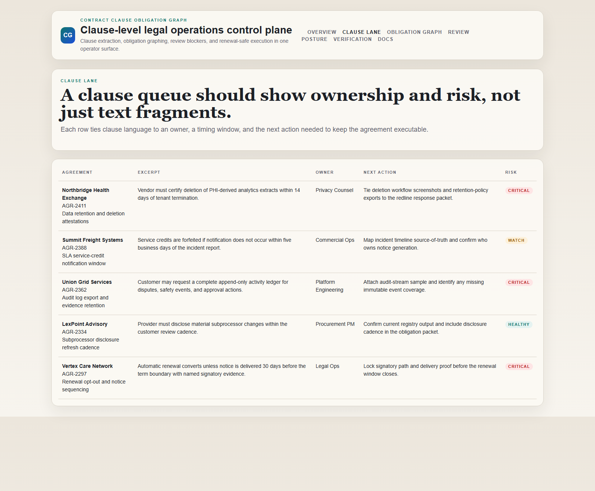
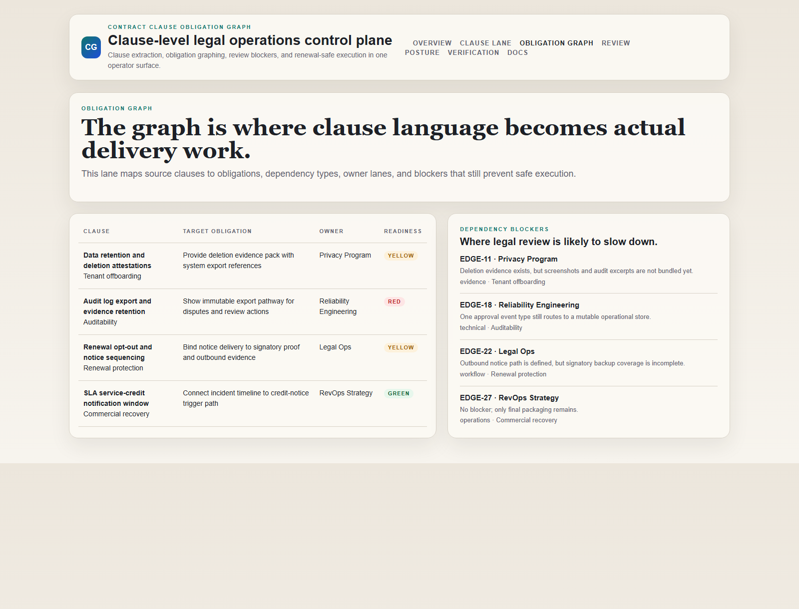
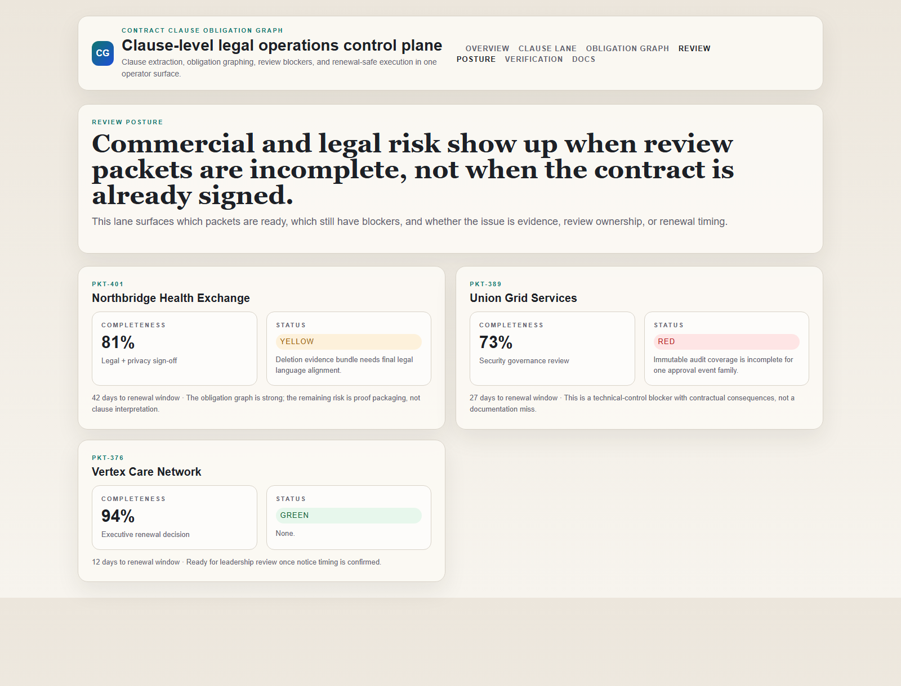

# Contract Clause Obligation Graph

[](https://github.com/mizcausevic-dev/contract-clause-obligation-graph/actions/workflows/ci.yml)
[](./LICENSE)
[](./.github/dependabot.yml)
[](https://github.com/mizcausevic-dev/contract-clause-obligation-graph/actions/workflows/pages.yml)

TypeScript control plane for clause extraction posture, obligation graphs, review blockers, and renewal-safe execution across enterprise agreements.

## Why this exists

- Contract work often breaks after the text is understood because ownership, notice windows, and evidence duties are still fragmented.
- Legal and non-legal teams need a clause view that leads to action, not just a summary of redlines.
- Renewal and dispute risk build when obligations are visible in the document but invisible in the workflow.
- Enterprise buyers care less about “AI for contracts” in the abstract and more about whether obligations can be executed safely.

## Why this matters (KG Embedded tie-back)

This repo demonstrates the obligation graph primitive for LegalTech buyers: clause-level extraction tied to owner lanes, review blockers, auditability, and renewal pressure. A B2B SaaS buyer would care because legal commitments often need to surface inside customer-facing dashboards and internal operating tools without exposing unsafe write paths or uncontrolled BI sprawl. Kinetic Gain Embedded extends this into security-first in-product analytics for clause- and obligation-aware reporting across customer accounts, see [kineticgain.com/embedded](https://kineticgain.com/embedded).

## Routes

- `/`
- `/clause-lane`
- `/obligation-graph`
- `/review-posture`
- `/verification`
- `/docs`

## API

- `/api/dashboard/summary`
- `/api/clause-lane`
- `/api/obligation-graph`
- `/api/review-posture`
- `/api/verification`
- `/api/sample`

## Screenshots






## Local Development

```powershell
cd contract-clause-obligation-graph
npm install
npm run dev
```

Open:
- [http://127.0.0.1:5426/](http://127.0.0.1:5426/)
- [http://127.0.0.1:5426/clause-lane](http://127.0.0.1:5426/clause-lane)
- [http://127.0.0.1:5426/obligation-graph](http://127.0.0.1:5426/obligation-graph)
- [http://127.0.0.1:5426/review-posture](http://127.0.0.1:5426/review-posture)
- [http://127.0.0.1:5426/verification](http://127.0.0.1:5426/verification)

## Validation

- `npm run build`
- `npm run test`
- `npm run demo`
- `npm run smoke`
- `npm run render:assets`

## Production status

<!-- Maintained by Claude Code (Platform/SRE lane) after v1.0-prod hardening. -->

| Aspect | Status |
|--------|--------|
| CI | Node 20 + 22 matrix — lint · typecheck · coverage · build · demo · smoke · `npm audit` ([workflow](./.github/workflows/ci.yml)) |
| Test coverage | 100% statements on `src/services/` (gate: ≥ 60%) |
| License | [AGPL-3.0-or-later](./LICENSE) |
| Dependencies | Dependabot weekly (npm + GitHub Actions); `npm audit --audit-level=high` in CI |
| Security | [SECURITY.md](./SECURITY.md) — 0 known high/critical advisories at v1.0-prod |
| Deploy | Static prerender → **https://clauses.kineticgain.com/** (GitHub Pages, [pages workflow](./.github/workflows/pages.yml)) |

## Docs

- [Architecture](./docs/architecture.md)
- [Origin](./docs/ORIGIN.md)
- [Kinetic Gain Embedded tie-back](./docs/KINETIC_GAIN_EMBEDDED.md)
- [Changelog](./CHANGELOG.md)

## Part of the Kinetic Gain Suite

Operator surface in the [Kinetic Gain Suite](https://suite.kineticgain.com/) — a portfolio of buyer-readable control planes spanning security posture, compliance evidence, data-platform governance, FinOps, and operator workflows. See the suite index for related surfaces. Apex: [kineticgain.com](https://kineticgain.com/).
